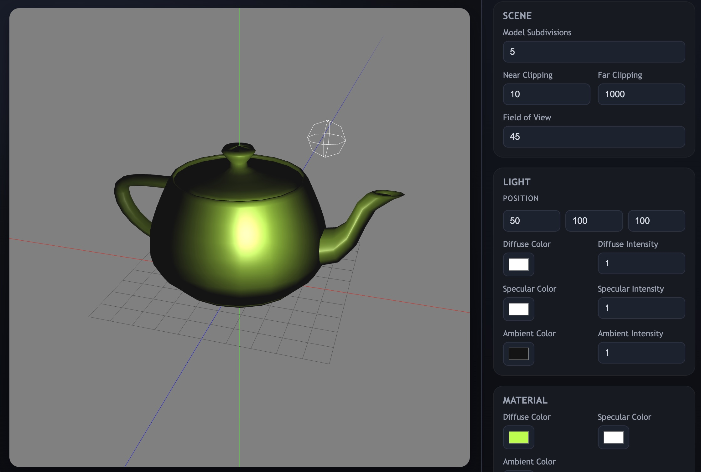

# 3D Model Viewer

A WebGL-based 3D model viewer that displays 3D models directly in the browser.

Try it out!: https://camerondetig.github.io/3D_Model_Viewer/

## Features

- Interactive 3D model rendering using WebGL
- Phong based point lighting
- Trackball Camera Controlls

